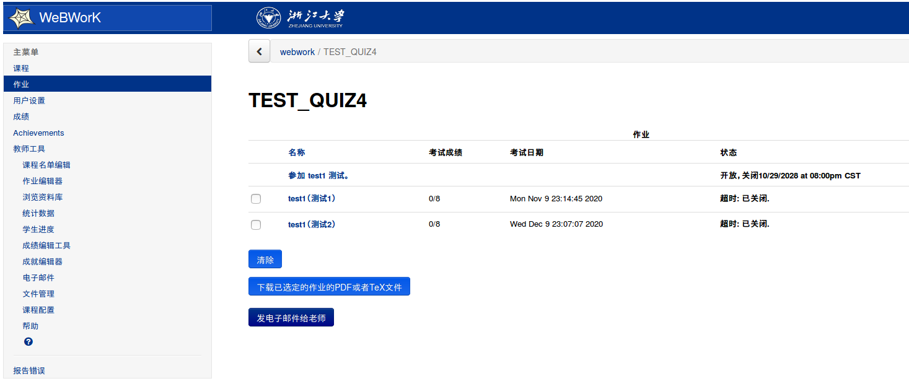
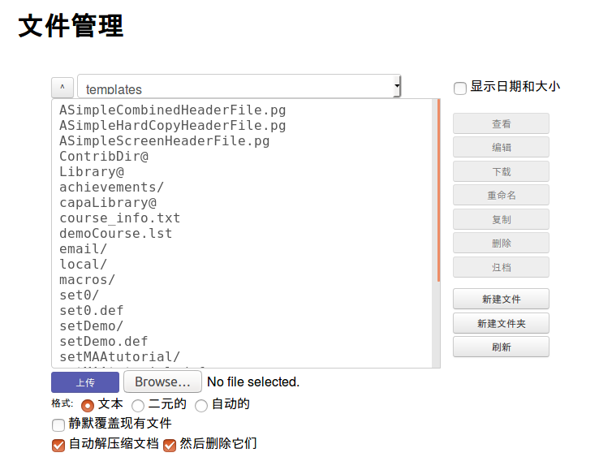
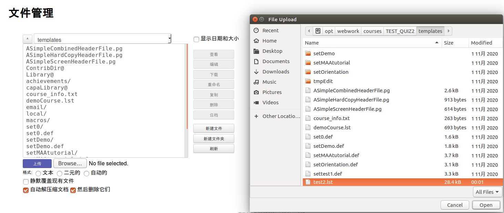
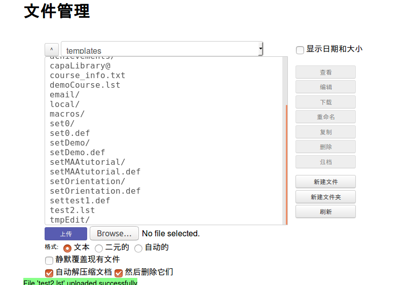
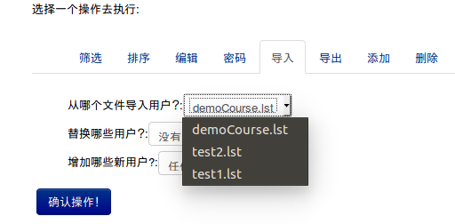
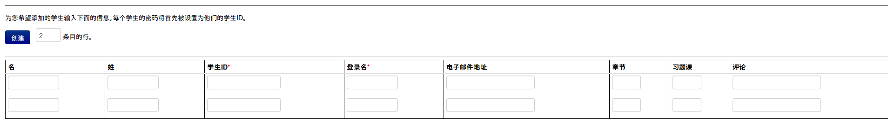
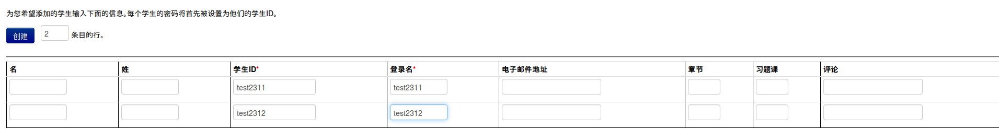
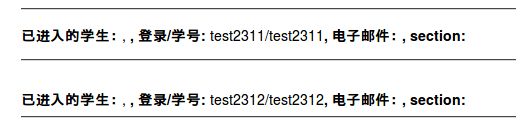

#  webwork使用说明
  
  
##  文件上传的操作
  
  
###  步骤
  
1. 主菜单点击文件管理
2. 可以看到文件管理的目录，最上方的`template`是当前文件夹名称，上传的文件会写入此文件夹
3. 点击`Browse`按钮，选择要上传的文件
4. 确定了上传的文件后，点击上传，可以看到文件被写入该目录下
  
####  进入文件管理
  
首先打开webwork网站，登录你管理的课程之后，可以见到课程首页，如下所示：

然后点击页面左侧的的文件管理（主菜单/教师工具/文件管理），看到如下的页面说明进入了文件管理。

  
####  文件管理界面说明
  
文件管理最上方`template`是当前浏览目录的文件夹，默认每一个课程都是分离的，即课程A和B都是独立的`template`文件夹。
文件管理中间的区域是当前文件夹下的文件，右侧可以进行基本的文件操作。
下方是上传文件的操作区域。
  
####  文件上传
  
分为两步，第一步是点击`Browse`按钮，然后添加你要上传的文件，如下图所示：

在选定文件后页面会显示你所选择上传的文件名，然后点击`上传`按钮，之后见到如下页面说明上传成功。

  
  
##  课程名单添加
  
**注意，除了邮箱信息，其余字段不要使用除了'-_'和空格以外的标点符号，所有的字母，数字，以及汉字等都是可以的。而对于邮箱，如果你要输入，需要保证地址是合法的，否则修改的信息不会被录入**
  
**举例而说，名字写`'ABC'`和`'银 行_-'`都是可以的，但是`'ABC,<'`和`'银、？行'`是不可以的**
###  步骤
  
有两种方式，第一种是直接从文件添加，第二种是临时性的添加。
  
###  从文件添加
  
1. 将写好的`lst`后缀的文件上传到`template`文件夹下
2. 主菜单点击`课程名单编辑`，选择`导入`
3. 选择你上传的`lst`文件，然后替换的用户选择`没有用户`，添加哪些新用户选择`任何用户`
4. 点击`确认操作`按钮
  
####  说明
  
1. 文件上传操作详见`文件上传`一节
2. 课程名单编辑选择导入后如下所示：
    
3. 如果你没有看到你添加`lst`文件，请重新刷新页面，由于是静态页面，所以如果你在多个页面同时完成了第一二步，会导致第二步的界面没有显示最新的版本，重新刷新就好
4. lst文件的格式详见`lst文件格式说明一节`
  
###  临时性添加
  
1. 进入`课程名单编辑`界面后选择`添加`
2. 输入你要添加的用户人数后，点击`确认操作`
3. 然后进入新的界面，将带有`*`号的字段全部填写完成后，点击`确认操作`按钮
4. 然后在页面上方会显示你添加的用户信息
  
####  说明
  
1. 如果你要添加大量的用户，推荐你选择`从文件添加`的方法
2. 学生的初始登录密码是和学生的ID(学生的ID是学号而不是登录用户名)一样的
3. 具体的操作流程截图如下：
    
    首先选择你添加的用户数量
    
    然后在你点击`确认操作`后会见到此界面
    
    之后你输入学生的基本信息，如果你要为这些用户布置作业，也可以勾选需要布置的作业
    
    在你点击`确认操作`按钮后，会告知你添加的用户信息
  
  
##  lst文件格式说明
  
`lst`文件格式类似于`csv`格式，使用英文的','将字段分隔为多个单元格，换行表示表格的新一行。
  
###  字段含义
  
以下按照从左到右的顺序介绍每一列的含义
1. `student_id`，学生的学号，也是必须要填写的项目
2. `last_name`，姓，学生的姓，可以不填写
3. `first_name`，名，学生的名，可以不填写
4. `status`，表示选课的状态，`C`表示已注册，也就是正常学生，老师管理员的状态,`D`表示退课,`A`表示审核中,`P`表示监督，确保你要录入的都是**已注册**状态即可
5. `comment`，此字段留空，暂时并没有使用
6. `section`，此字段留空，暂时并没有使用
7. `recitation`，此字段留空，暂时并没有使用
8. `email_address`，学生电子邮箱地址，可以不填写
9. `user_id`，学生的登录ID，必须填写，而且后期**不可更改**，是唯一的凭证，也是唯一不可用后期更改的
10. `password`，学生的登录密码，这个字段不要填写，其是加盐后的哈希值，并不是直接的密码
11. `permission`，用户的权限，不同的数字表示不同的权限，级别在前，对于数字在后，分别为`管理员 20`,`教授 10`,`助教 5`,`评分_代理人 3`,`登录_代理人 2`,`学生 0`和`访客 -5`。管理员拥有课程的全部管理权限，可以修改他人的权限，**在页面上，修改信息时，默认的权限是访客**（也能改自己的，但是一旦此课程没有管理员了，就只能找运维帮你直接数据库里改了）
  
###  示例文件
  
```lst
# Field order: student_id,last_name,first_name,status,comment,section,recitation,email_address,user_id,password,permission
admin,Administrator,ces,C,,,,,admin,.bxpcera4I/bg,20
test_user100,test_user100,,C,,,,,test_user100,$6$f4dUSFX70h9oWxcq$2S0YZmD4eEkjiyHVmxzLPMM3t1Ewo9fdge0mVfPa8MrmFcbKakHCZwn2LNkRUc/IOK.yTptRbVso1r8gq5Edu0,10
test_user101,test_user101,,C,,,,,test_user101,$6$Be/lJeIto5yBTkW0$fEuzKZ35Q.mzQKEjj3P/g.VzZ.t.zb0rcd5KYpHvO1NmN5DiWFBlXPra5CpAqbu.oFVv1WIcVUIOPdNW0EVAS0,5
test_user102,test_user102,,C,,,,,test_user102,$6$U/2tA5cQfNmVOkqb$KwgbWRnnj3OBc1htkiwUvk/EBBgyTY8wZSCWOowUW2gdpXmPthbxyA0lY2zBh70qa5fSSDJy9ok.khXx3zLJW1,3
test_user103,test_user103,,C,,,,,test_user103,$6$wFRHaJG6U9rKpIuD$Skrax2nC86e528lkUwuQIL/JnEK8VHYNHOAaked1Ipu6fm0tPnh6tOSSAeqt8iiUXutEzUaYZtdAjWErmSHq90,2
test_user104,test_user104,,C,,,,,test_user104,$6$GeRdZHxirbjLdocf$TKUpIKEQVgHcnqDmc.au31LqJGagFuWJ.uzXOzj8S5bT4jbzA2wH8ce.b0WUwVmypc3LvTxIYDB9oTBXM2kmq1,0
test_user105,test_user105,,C,,,,,test_user105,$6$3BHx5eh3mZBmc.BZ$k.dVMPFf3cTCodBdwmBn/xB8v89tvkUFwMN4g5EUfirQU0L7ZtfpN5op6W6fJLnCO6lMJmJQJ6.BpBu1k0npq.,0
test_user106,test_user106,,C,,,,,test_user106,$6$LQVmCxKA5ILuE2GM$a/VuLJk0DCX4h4jA.hi3CHP087lPWibtISiYiBH8pnOfXZmAfWcc8erJGyRVNzYTc1BlciQiskN6qFhV75jDj0,-5
  
```  
  
注意第一行被注释了，并没有真实添加
  
###  使用Excel制作
  
一共分为三步：
1. 首先建立一个包含了学号的excel文件
2. 将excel的格式按照给出的`demo.xlsx`进行排布
3. 另存为`csv`格式，并改名后缀为`lst`
  
其中，你需要保证第一列(`列A`)是学生的学号，第四列(`列D`)是学生的注册状态，统一为大写字母`C`，第九列(`列I`)为登录的ID，推荐和学生学号相一致，第十一列(`列K`)为学生的权限，对于学生统一为0。
  
**再次强调，密码留空不要设置**，这样用户的登录密码会是学生的ID，也就是你第一列的内容。
  
  